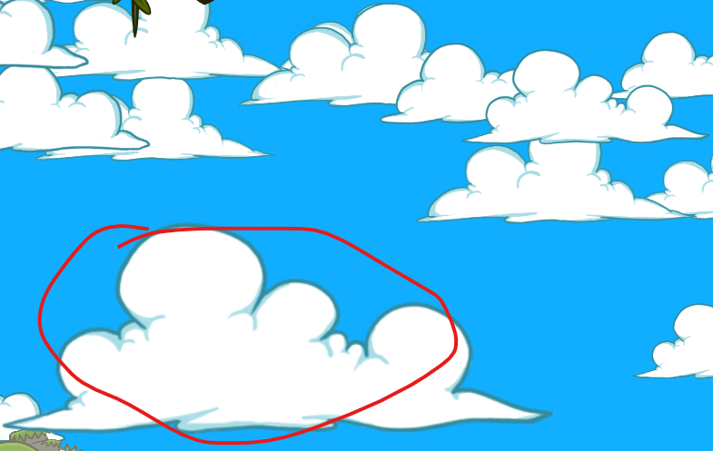
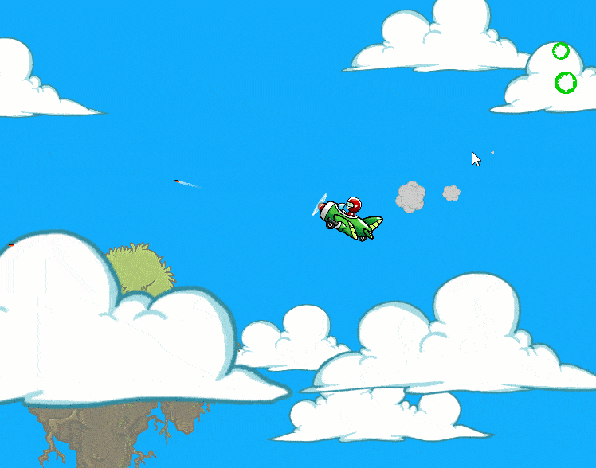

#
https://gamedev.ru/projects/forum/?id=266143&page=102
## aliskda
Леталка на самолёте
Приятная сочная графика, немного смешные звуки.
Визуальное впечатление немного портят размытые большие облака:

Очень высокая сложность, неудобное управление (самолёт всё время падает, непонятно, как лететь вверх).
Понравилось наличие сюжета, не понравилось отсутствие русского языка.
Версия игры с неограниченным fps у меня тоже глючила, версия с фиксом работает нормально.
При вращении самолёта вокруг своей оси что-то не то происходит с анимацией.

## CStalker
Забавная 2D леталка с милой графикой и такой же озвучкой, сделанной самим автором. Есть прокачка самолетика, радар, сюжетные задания - все неплохо реализовано, как и спрайты роботов и пчел. Напомнило TaleSpin на денди, только с сильно реалистичным управлением. Это хардкордное управление может отпугнуть неподготовленного игрока, я вот долго к нему привыкал.

## Haika
интересненькая игрушка, озвучка топ

## i4ugui
На старте не понятно что надо нажать esc, при нажатии на enter игра чуть проходит вперед и табличка останется. Быстро валится в штопор, так задумано?, очень страшно делать развороты, это поведение сильно не дает играть. Апгрейдов много, но игра просится просто быть аркадкой, если убрать дурацкий штопор то можно будет аркадить.

## Incvisitor
Жесть, английское интро. Можно было смело его убирать. Но самый фешн, это специфичное, отвратительное управление самолетом (видимо закос под мобилы), но для ПК это просто ужасное управление. Мне оно крайне не понравилось, поэтому пробовать дальше первого поражения я не стал.

## kkolyan
Игра основана на эксперименте с псевдо-реалистичным экстремальным управлением самолета в 2D. Идеальный вариант был бы в том, чтобы игрок использовал на полную нештатные режимы самолета в тактических целях. На мой взгляд, идея провалилась - если двигаться в этом направлении, то честную физику надо заменять голливудским фейком.
Еще была попытка сделать оригинальную прогрессию, но в последний момент (длившийся 2 недели, правда, но у меня очень мало времени по вечерам) перепилено на стандартную дьяблоидную, т.к. она банально проверена временем и чтобы хотя бы этот аспект был сразу понятен игроку.
Также, похоже перебрал со сложностью типа-эндгейм монстров (к которым, впрочем, прилететь можно и сразу, несмотря на условное отделения - опенворлд ;D). В последний момент успел чуть понерфить и раскидать. ну чтобы и казуалам было где полетать и чтоб хардкорщики имели возможность повесеситься. В целом, не рассчитывал что кто-то пройдет игру полностью, да и она в целом больше не на прохождение, а про самолюбование после оттачивания пилотажных трюков, а прокачка и задания - так, для затравки.
В игре много внимания уделено эргономике, что лично для меня имеет высокую ценность в рамках местечкового конкурса.
Шуточная озвучка - надеюсь что она у вас вызывала посткринж, а не брезгливость. Но на всякий случай звук отключается и инфа об этом выведена на видное место.
Сеттинг и визуал - на мой взгляд, ассеты подобраны очень удачно (дым, проджектайлы и квестовые айтемы - рисовал сам, т.к. не нашел настолько же подходящих на стоках без подписки).

## LLI.T.A.L.K.E.R.
6 - в обучении нет обучения стрельбы и тактики боя. В игре масса быстростреляющих врагов, а при таком управлении не понятно, то ли с места стрелять, то ли в быстром полёте. Но на месте тебя быстро расстреляют и вообще потеряешь баланс полёта. При стрельбе в полёте - не успеваешь расстрелять, так как обзора мало. Быстро теряешь контроль полёта, не поняв даже тактики стрельбы во врагов.

## samrrr
Управление не соответствует графике. Закрыть стартовое окно удалось только с F1-Esc, на кнопку с надписью 1 игра не отзывается, позже я понял, что это оказывается не кнопка выбора ответа как в FTL а переключатель табов, только вот он должен быть сверху и не показываться когда только 1 вариант ответа. Текст сообщения налазит на эту кнопку "1". Хелп есть, толку нет, об управлении пришлось искать ответ в инете. Сами задания не учитывают то, что я мог уже подобрать диск более высокого тира. Мир явно грузится не весь и трупы зачем-то сохраняются в неактивной части мира, из-за этого начинается трупопад при пролёте под ранее убитыми врагами. Так-же проблемы с загрузкой мобья у края карты, выглядит как внезапное появление 2 больших мобов на пустом острове и мнгновенный запуск в меня пары ракет с гарантированным попаданием. Раза 3 меня вальнули 9 мобов трущихся у респа. Карта не работает как надо, передвинувшиеся осы показываются на карте там, где заспавнены. Диски же на карте не показываются. Звуки в игре сделаны хорошо. Только вот они почемуто иногда начинают полностью отрубаться со звуком тррр. Видимо превышен лимит в толичество параллельных звуков. Геймдизайн оставляет желать лучшего, хиллка имбанутая а стоит только 1 очко. Нафига я собираю диски ежели они мне ничего не дают, экспы от их подбора я не заметил. Левелап я должен заметить сам если играю без звука. Неужели трудно вывести "Новый уровень!"? Разное оружие не имеет смысла, так как я тупо зажимал всё, и все противники по ходу движения дохли. Описание апов хп не даёт понять сколько хп мне прибавится. Описание ускорения не даёт мне понять, насколько я апнусь, и потребует ли она больше маны. Описание манны не говорит насколько апнется реген и манна. Всё ттх оборудования я узнал только купив кота в мешке. Я надеялся что ракетка с наведением, но фиг мне. Что за лазер ган и какой от него толк я так и не понял. Игра наклала мне 2 файла в папку загрузок. В начальных настройках поюзан такой режим что ни скрин сделать, ни видео иксбоксом записать не получается. Зачем в игре 2 одинаковые пушки так и не понял. Жаль не могу все пушки на 1 кнопку повесить. Изза незнания разрабом ТАУ(или хотябы нейросетей) и управления мышью самолётик начинает кружиться и не может остановиться без знания что и как нужно делать. Естественно в хелпе об этом ничего не сказанно.

## Super_inoy
(прошел) отличная игра, ну за звуки минус балл, ну и за острова тоже минус балл из трех.
